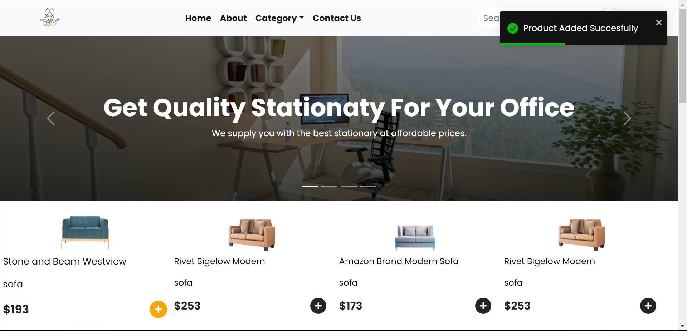

#Portforlio project - Foundation

The portfolio project is a capstone for the fundation (first 9 months) of the software Engineering studies at [ALX Africa](https://www.alxafrica.com/software-engineering-2022/), a course offered by [Holberton School](https://www.holbertonschool.com/).

##About the project

**Project name and tagline**
* Name: [Wolelight Trading](wholelight.vercel.app) Ecomerce Website
* tagline: We get you the best accessoriries? 

## Team Members
* Ephraim Matarutse

**Technologies**
* HTML5 & JavaScript
* Linux
* Git and GitHub
* React

**Challenge Statement**

Creating an ecommerce website for cellphones and accessories can be a challenging task, but it has the potential to significantly improve the customer experience. By providing a platform where customers can access reviews and leave their own feedback, the retailer can build trust and credibility with its users. This, in turn, can lead to increased sales and customer loyalty. Additionally, by allowing customers to create accounts and save their preferences, the website can help to foster a sense of community and personalization, further enhancing the overall shopping experience.

**Risks**
* Technical risk: Security attack on the customer database.
* Non-technical risk: Insincere reviews.

**Infrastructure**
* Since this is an individual project, all the work will be done on the master branch.
* The project will use containers for deployment.
* Cloud deployment

**Existing Solutions**
* ebay.com. Edmunds is one of the more popular car review websites, with an average of 16 million unique visitors per month. Edmunds offers in-depth reviews from professional car reviewers as well as everyday drivers

##Project Breakdown
Adding user management to the application

1. Implementing user management using the Django user authentication system.
2. Settting up continuous integration and delivery
   
**Implementing backend services**

1. Creating cloud functions to manage dealers and reviews
2. Creating Django models and views to manage car model and car make
3. Creating Django proxy services and views to integrate dealers, reviews, and cars together

**Add dynamic pages with Django templates**

1. Creating a page that shows all the accesories available for sale.
2. Creating a page that shows details for the selected product.
3. Creating a page that let's the end user checkout and buy online.

**Additional: Containerization**

1. Adding deployment artifacts to the application
2. Deploying the application

**Controbutors: [Ephraim Matarutse](https://github.com/dopswae98)**

